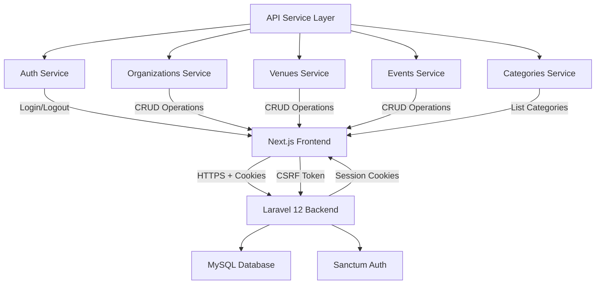
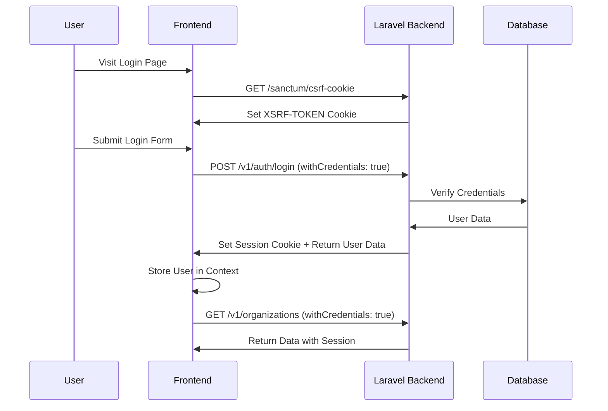

# Biletim Admin Panel - API Integration Architectural Plan

## 📋 Executive Summary

This document outlines the architectural plan for integrating the **Biletim Admin Panel** (Next.js 15 + React) with the **Biletleme Platform Backend** (Laravel 12 + Sanctum). The backend uses a hybrid authentication system: **Cookie-based (Stateful)** for web applications and **Bearer Token (Stateless)** for mobile applications.

---

## 🎯 Integration Goals

1. **Implement Cookie-based Sanctum Authentication** for web (CSRF protection)
2. **Replace mock data** with real API endpoints
3. **Create type-safe API service layer** with proper TypeScript interfaces
4. **Implement proper error handling** and user feedback mechanisms
5. **Add loading states** throughout the application
6. **Support role-based access control** (SUPER_ADMIN, ORG_ADMIN, CO_ADMIN)
7. **Test with provided test users** and organizations

---

## 🏗️ System Architecture



---

## 📊 Authentication Flow

### Web Authentication Flow (Cookie-based)



### Key Points

- **CSRF Token**: Must fetch `/sanctum/csrf-cookie` before login
- **Credentials**: All requests must include `withCredentials: true`
- **Session Management**: Backend manages session via cookies
- **No Bearer Token**: Web app doesn't use Authorization header

---

## 🗂️ Project Structure

```
src/
├── lib/
│   ├── api/
│   │   ├── client.ts                 # ✅ Existing - needs CSRF support
│   │   ├── services/
│   │   │   ├── auth.service.ts       # 🆕 Authentication endpoints
│   │   │   ├── organizations.service.ts  # 🆕 Organizations CRUD
│   │   │   ├── venues.service.ts     # 🆕 Venues CRUD
│   │   │   ├── events.service.ts     # 🆕 Events CRUD
│   │   │   ├── categories.service.ts # 🆕 Event Categories
│   │   │   └── index.ts              # 🆕 Export all services
│   │   └── types/
│   │       ├── api-responses.ts      # 🆕 Backend response types
│   │       └── biletleme.types.ts    # 🆕 Biletleme-specific types
│   ├── hooks/
│   │   ├── useToast.ts               # 🆕 Toast notifications
│   │   └── useAsync.ts               # 🆕 Async state management
├── contexts/
│   └── auth-context.tsx              # ⚙️ Update to use real API
├── types/
│   ├── auth.types.ts                 # ⚙️ Update with backend structure
│   └── organization.types.ts         # 🆕 Organization types
└── components/
    ├── ui/
    │   ├── toast.tsx                 # 🆕 Toast component
    │   └── loading-spinner.tsx       # 🆕 Loading component
    └── error-boundary.tsx            # 🆕 Error boundary

Legend:
✅ Existing file to modify
🆕 New file to create
⚙️ Significant updates needed
```

---

## 🔧 Technical Implementation Plan

### Phase 1: Environment & Configuration

#### 1.1 Environment Variables

Create `.env.local` file:

```env
# Backend API Configuration
NEXT_PUBLIC_API_BASE_URL=http://your-backend-url.com
NEXT_PUBLIC_API_VERSION=v1

# Environment
NEXT_PUBLIC_ENV=development

# Features
NEXT_PUBLIC_ENABLE_MOCK_DATA=false
```

#### 1.2 Update API Client for CSRF Support

**Current Issue**: [`client.ts`](src/lib/api/client.ts:1) uses Bearer token approach (mobile style)

**Required Changes**:
- Add `withCredentials: true` to axios config
- Implement CSRF token fetching before authentication
- Remove Bearer token from request interceptor for web
- Keep error handling but improve error messages

**Key Code Changes**:

```typescript
// src/lib/api/client.ts
constructor() {
  this.client = axios.create({
    baseURL: `${API_BASE_URL}/api/${API_VERSION}`,
    timeout: 30000,
    withCredentials: true,  // 🆕 Enable cookies
    headers: {
      "Content-Type": "application/json",
      "Accept": "application/json",
    },
  });
}

// 🆕 Add CSRF token fetching method
async getCsrfToken(): Promise<void> {
  await axios.get(`${API_BASE_URL}/sanctum/csrf-cookie`, {
    withCredentials: true,
  });
}
```

---

### Phase 2: TypeScript Type Definitions

#### 2.1 Backend Response Wrapper

All backend responses follow this format:

```typescript
// src/lib/api/types/api-responses.ts

export interface ApiResponse<T> {
  data: T;
}

export interface ApiErrorResponse {
  message: string;
  errors?: Record<string, string[]>;
}

export interface PaginatedResponse<T> {
  data: T[];
  meta: {
    current_page: number;
    from: number;
    last_page: number;
    per_page: number;
    to: number;
    total: number;
  };
  links: {
    first: string;
    last: string;
    prev: string | null;
    next: string | null;
  };
}
```

#### 2.2 Biletleme Platform Types

```typescript
// src/lib/api/types/biletleme.types.ts

export interface Organization {
  id: number;
  name: string;
  slug: string;
  description?: string;
  logo?: string;
  address?: string;
  phone?: string;
  email?: string;
  website?: string;
  created_at: string;
  updated_at: string;
}

export interface Venue {
  id: number;
  organization_id: number;
  name: string;
  slug: string;
  address: string;
  city: string;
  country: string;
  capacity: number;
  latitude?: number;
  longitude?: number;
  created_at: string;
  updated_at: string;
}

export interface Event {
  id: number;
  organization_id: number;
  venue_id: number;
  category_id: number;
  title: string;
  slug: string;
  description?: string;
  start_date: string;
  end_date: string;
  status: EventStatus;
  featured_image?: string;
  ticket_price?: number;
  total_tickets?: number;
  available_tickets?: number;
  created_at: string;
  updated_at: string;
}

export type EventStatus = "draft" | "published" | "cancelled" | "completed";

export interface EventCategory {
  id: number;
  name: string;
  slug: string;
  icon?: string;
  created_at: string;
  updated_at: string;
}

export interface BackendUser {
  id: number;
  name: string;
  email: string;
  role: BackendUserRole;
  organization_id?: number;
  organizations?: Organization[];  // For CO_ADMIN
  created_at: string;
  updated_at: string;
}

export type BackendUserRole = "SUPER_ADMIN" | "ORG_ADMIN" | "CO_ADMIN";
```

#### 2.3 Update Existing Auth Types

```typescript
// src/types/auth.types.ts - Update User interface

export interface User {
  id: number;                      // Changed from string to number
  name: string;
  email: string;
  phone?: string;
  role: BackendUserRole;           // Use backend roles
  organization_id?: number;         // Added
  organizations?: Organization[];   // Added for CO_ADMIN
  status: UserStatus;
  avatar?: string;
  createdAt: string;
  updatedAt: string;
}

export type BackendUserRole = "SUPER_ADMIN" | "ORG_ADMIN" | "CO_ADMIN";
```

---

### Phase 3: API Service Layer

#### 3.1 Authentication Service

```typescript
// src/lib/api/services/auth.service.ts

interface LoginCredentials {
  email: string;
  password: string;
}

interface LoginResponse {
  user: BackendUser;
}

class AuthService {
  private client = apiClient;

  async getCsrfToken(): Promise<void> {
    await this.client.getCsrfToken();
  }

  async login(credentials: LoginCredentials): Promise<LoginResponse> {
    // First, get CSRF token
    await this.getCsrfToken();
    
    // Then, login
    const response = await this.client.post<ApiResponse<{ user: BackendUser }>>(
      "/auth/login",
      credentials
    );
    
    return response.data;
  }

  async logout(): Promise<void> {
    await this.client.post("/auth/logout");
  }

  async getCurrentUser(): Promise<BackendUser> {
    const response = await this.client.get<ApiResponse<{ user: BackendUser }>>(
      "/auth/me"
    );
    return response.data.user;
  }

  async register(data: RegisterRequest): Promise<LoginResponse> {
    const response = await this.client.post<ApiResponse<{ user: BackendUser }>>(
      "/auth/register",
      data
    );
    return response.data;
  }
}

export const authService = new AuthService();
```

#### 3.2 Organizations Service

```typescript
// src/lib/api/services/organizations.service.ts

class OrganizationsService {
  private client = apiClient;

  async getAll(): Promise<Organization[]> {
    const response = await this.client.get<ApiResponse<Organization[]>>(
      "/organizations"
    );
    return response.data;
  }

  async getById(id: number): Promise<Organization> {
    const response = await this.client.get<ApiResponse<Organization>>(
      `/organizations/${id}`
    );
    return response.data;
  }

  async create(data: CreateOrganizationRequest): Promise<Organization> {
    const response = await this.client.post<ApiResponse<Organization>>(
      "/organizations",
      data
    );
    return response.data;
  }

  async update(id: number, data: UpdateOrganizationRequest): Promise<Organization> {
    const response = await this.client.put<ApiResponse<Organization>>(
      `/organizations/${id}`,
      data
    );
    return response.data;
  }

  async delete(id: number): Promise<void> {
    await this.client.delete(`/organizations/${id}`);
  }
}

export const organizationsService = new OrganizationsService();
```

#### 3.3 Venues Service

```typescript
// src/lib/api/services/venues.service.ts

class VenuesService {
  private client = apiClient;

  async getAll(organizationId?: number): Promise<Venue[]> {
    const params = organizationId ? { organization_id: organizationId } : {};
    const response = await this.client.get<ApiResponse<Venue[]>>(
      "/venues",
      { params }
    );
    return response.data;
  }

  async getById(id: number): Promise<Venue> {
    const response = await this.client.get<ApiResponse<Venue>>(
      `/venues/${id}`
    );
    return response.data;
  }

  async create(data: CreateVenueRequest): Promise<Venue> {
    const response = await this.client.post<ApiResponse<Venue>>(
      "/venues",
      data
    );
    return response.data;
  }

  async update(id: number, data: UpdateVenueRequest): Promise<Venue> {
    const response = await this.client.put<ApiResponse<Venue>>(
      `/venues/${id}`,
      data
    );
    return response.data;
  }

  async delete(id: number): Promise<void> {
    await this.client.delete(`/venues/${id}`);
  }
}

export const venuesService = new VenuesService();
```

#### 3.4 Events Service

```typescript
// src/lib/api/services/events.service.ts

class EventsService {
  private client = apiClient;

  async getAll(filters?: EventFilters): Promise<Event[]> {
    const response = await this.client.get<ApiResponse<Event[]>>(
      "/events",
      { params: filters }
    );
    return response.data;
  }

  async getById(id: number): Promise<Event> {
    const response = await this.client.get<ApiResponse<Event>>(
      `/events/${id}`
    );
    return response.data;
  }

  async create(data: CreateEventRequest): Promise<Event> {
    const response = await this.client.post<ApiResponse<Event>>(
      "/events",
      data
    );
    return response.data;
  }

  async update(id: number, data: UpdateEventRequest): Promise<Event> {
    const response = await this.client.put<ApiResponse<Event>>(
      `/events/${id}`,
      data
    );
    return response.data;
  }

  async delete(id: number): Promise<void> {
    await this.client.delete(`/events/${id}`);
  }

  async updateStatus(id: number, status: EventStatus): Promise<Event> {
    const response = await this.client.patch<ApiResponse<Event>>(
      `/events/${id}/status`,
      { status }
    );
    return response.data;
  }
}

export const eventsService = new EventsService();
```

#### 3.5 Categories Service

```typescript
// src/lib/api/services/categories.service.ts

class CategoriesService {
  private client = apiClient;

  async getAll(): Promise<EventCategory[]> {
    const response = await this.client.get<ApiResponse<EventCategory[]>>(
      "/event-categories"
    );
    return response.data;
  }

  async getById(id: number): Promise<EventCategory> {
    const response = await this.client.get<ApiResponse<EventCategory>>(
      `/event-categories/${id}`
    );
    return response.data;
  }
}

export const categoriesService = new CategoriesService();
```

---

### Phase 4: Update Auth Context

#### 4.1 Replace Mock Authentication

**File**: [`src/contexts/auth-context.tsx`](src/contexts/auth-context.tsx:1)

**Key Changes**:
1. Remove mock delays and mock data
2. Use `authService` for real API calls
3. Handle CSRF token before login
4. Store user data from backend response
5. Implement proper error handling

```typescript
// src/contexts/auth-context.tsx - Updated

const login = async (credentials: LoginRequest) => {
  setIsLoading(true);
  try {
    // Real API call
    const response = await authService.login(credentials);
    
    const user: User = {
      id: response.user.id,
      name: response.user.name,
      email: response.user.email,
      role: mapBackendRole(response.user.role),
      organization_id: response.user.organization_id,
      organizations: response.user.organizations,
      status: "active",
      createdAt: response.user.created_at,
      updatedAt: response.user.updated_at,
    };

    setUser(user);
    localStorage.setItem("user", JSON.stringify(user));
  } catch (error) {
    console.error("Login failed:", error);
    throw error;
  } finally {
    setIsLoading(false);
  }
};

const logout = async () => {
  try {
    await authService.logout();
  } catch (error) {
    console.error("Logout failed:", error);
  } finally {
    setUser(null);
    setToken(null);
    localStorage.removeItem("user");
    localStorage.removeItem("token");
  }
};
```

---

### Phase 5: Error Handling & User Feedback

#### 5.1 Toast Notification System

```typescript
// src/lib/hooks/useToast.ts

interface ToastOptions {
  title: string;
  description?: string;
  variant?: "default" | "success" | "error" | "warning";
  duration?: number;
}

export function useToast() {
  const showToast = (options: ToastOptions) => {
    // Implementation using shadcn/ui toast or custom toast
  };

  return {
    toast: showToast,
    success: (message: string) => showToast({ title: message, variant: "success" }),
    error: (message: string) => showToast({ title: message, variant: "error" }),
    warning: (message: string) => showToast({ title: message, variant: "warning" }),
  };
}
```

#### 5.2 Enhanced Error Handling in API Client

```typescript
// src/lib/api/client.ts - Enhanced error handling

this.client.interceptors.response.use(
  (response) => response,
  async (error: AxiosError<ApiErrorResponse>) => {
    const errorMessage = error.response?.data?.message || "Bir hata oluştu";
    const errors = error.response?.data?.errors;

    // Handle validation errors
    if (error.response?.status === 422 && errors) {
      return Promise.reject({
        message: errorMessage,
        validationErrors: errors,
        status: 422,
      });
    }

    // Handle 401 Unauthorized
    if (error.response?.status === 401) {
      localStorage.removeItem("user");
      window.location.href = "/login";
    }

    // Handle 403 Forbidden
    if (error.response?.status === 403) {
      return Promise.reject({
        message: "Bu işlem için yetkiniz bulunmuyor",
        status: 403,
      });
    }

    return Promise.reject({
      message: errorMessage,
      status: error.response?.status,
    });
  }
);
```

---

### Phase 6: Update Pages with Real Data

#### 6.1 Events Page Updates

**File**: [`src/app/(dashboard)/events/page.tsx`](src/app/(dashboard)/events/page.tsx:1)

**Changes**:
1. Replace mock data with `eventsService.getAll()`
2. Add loading state
3. Add error handling
4. Update event status with real API calls

```typescript
// Simplified example
const [events, setEvents] = useState<Event[]>([]);
const [isLoading, setIsLoading] = useState(true);
const [error, setError] = useState<string | null>(null);

useEffect(() => {
  async function fetchEvents() {
    try {
      setIsLoading(true);
      const data = await eventsService.getAll();
      setEvents(data);
    } catch (err) {
      setError("Etkinlikler yüklenemedi");
      toast.error("Etkinlikler yüklenemedi");
    } finally {
      setIsLoading(false);
    }
  }
  
  fetchEvents();
}, []);
```

#### 6.2 Users Page Updates

Similar pattern for users - fetch from backend with proper role filtering based on logged-in user's permissions.

#### 6.3 Dashboard Page Updates

Fetch real statistics from backend endpoints instead of using mock data from [`src/lib/mock-data/dashboard.ts`](src/lib/mock-data/dashboard.ts:1).

---

## 🧪 Testing Strategy

### Test Users (from [`bilet-api-detail.md`](bilet-api-detail.md:2))

| Role | Email | Password | Access |
|------|-------|----------|--------|
| SUPER_ADMIN | superadmin@biletix.com | password | ALL DATA |
| ORG_ADMIN | bkm@admin.com | password | BKM only |
| ORG_ADMIN | zorlu@admin.com | password | Zorlu PSM only |
| ORG_ADMIN | anadolu@admin.com | password | Anadolu only |
| ORG_ADMIN | ege@admin.com | password | Ege only |
| CO_ADMIN | coadmin@biletleme.com | password | Anadolu + Ege |

### Test Organizations

1. **BKM** (ID: 1)
2. **Zorlu PSM** (ID: 2)
3. **Anadolu Gösteri** (ID: 3)
4. **Ege Etkinlik** (ID: 4)

### Testing Checklist

- [ ] Login with each test user
- [ ] Verify SUPER_ADMIN sees all organizations
- [ ] Verify ORG_ADMIN sees only their organization
- [ ] Verify CO_ADMIN sees Anadolu + Ege only
- [ ] Test CRUD operations for events
- [ ] Test CRUD operations for venues
- [ ] Test organization management
- [ ] Verify CSRF protection is working
- [ ] Test logout functionality
- [ ] Test session persistence on page refresh

---

## 📝 Implementation Checklist

### Phase 1: Setup & Configuration
- [ ] Create `.env.local` with backend URL
- [ ] Update [`client.ts`](src/lib/api/client.ts:1) with CSRF support and `withCredentials`
- [ ] Remove Bearer token interceptor for web
- [ ] Test CSRF cookie fetching

### Phase 2: Type Definitions
- [ ] Create `src/lib/api/types/api-responses.ts`
- [ ] Create `src/lib/api/types/biletleme.types.ts`
- [ ] Update [`src/types/auth.types.ts`](src/types/auth.types.ts:1)
- [ ] Create `src/types/organization.types.ts`
- [ ] Update role types to match backend

### Phase 3: API Services
- [ ] Create `src/lib/api/services/auth.service.ts`
- [ ] Create `src/lib/api/services/organizations.service.ts`
- [ ] Create `src/lib/api/services/venues.service.ts`
- [ ] Create `src/lib/api/services/events.service.ts`
- [ ] Create `src/lib/api/services/categories.service.ts`
- [ ] Create `src/lib/api/services/index.ts` (barrel export)

### Phase 4: Authentication
- [ ] Update [`auth-context.tsx`](src/contexts/auth-context.tsx:1) with real API calls
- [ ] Implement CSRF token fetching before login
- [ ] Update login flow with proper error handling
- [ ] Update logout to call backend endpoint
- [ ] Add session restoration on app load
- [ ] Test with all test users

### Phase 5: UI Components
- [ ] Create toast notification component
- [ ] Create loading spinner component
- [ ] Create error boundary component
- [ ] Add loading states to all pages
- [ ] Add error states to all pages

### Phase 6: Page Updates
- [ ] Update Events page with real API
- [ ] Update Users page with real API
- [ ] Update Dashboard with real statistics
- [ ] Update Payouts page with real API
- [ ] Update Reports page with real data
- [ ] Update Ticket Sales page with real API
- [ ] Update Settings pages with real API

### Phase 7: Role-Based Access Control
- [ ] Implement organization filtering for ORG_ADMIN
- [ ] Implement multi-organization access for CO_ADMIN
- [ ] Add permission checks before API calls
- [ ] Hide/disable UI elements based on permissions

### Phase 8: Testing & Refinement
- [ ] Test login with all test users
- [ ] Verify data access restrictions
- [ ] Test CRUD operations
- [ ] Test error scenarios
- [ ] Test session persistence
- [ ] Test logout flow
- [ ] Performance optimization
- [ ] Security audit

---

## 🔐 Security Considerations

1. **CSRF Protection**: Mandatory for all state-changing operations
2. **Cookie Settings**: `httpOnly`, `secure`, `sameSite=strict`
3. **CORS**: Backend must whitelist frontend domain
4. **Data Access**: Enforce role-based filtering on backend
5. **Input Validation**: Use Zod schemas before API calls
6. **XSS Prevention**: Sanitize user inputs
7. **Error Messages**: Don't expose sensitive information

---

## 🚀 Deployment Considerations

### Frontend (Next.js)
- Set `NEXT_PUBLIC_API_BASE_URL` to production backend URL
- Enable `NEXT_PUBLIC_ENABLE_MOCK_DATA=false`
- Configure proper CORS on backend for production domain

### Backend (Laravel)
- Ensure `sanctum.stateful` includes frontend domain
- Configure `session.domain` and `session.secure`
- Set up proper CORS middleware
- Enable API rate limiting

---

## 📚 API Endpoints Reference

### Authentication
- `GET /sanctum/csrf-cookie` - Get CSRF token
- `POST /v1/auth/login` - Login
- `POST /v1/auth/logout` - Logout
- `GET /v1/auth/me` - Get current user
- `POST /v1/auth/register` - Register new user

### Organizations
- `GET /v1/organizations` - List all (filtered by role)
- `GET /v1/organizations/{id}` - Get single
- `POST /v1/organizations` - Create (SUPER_ADMIN only)
- `PUT /v1/organizations/{id}` - Update
- `DELETE /v1/organizations/{id}` - Delete

### Venues
- `GET /v1/venues` - List all (filtered by organization)
- `GET /v1/venues/{id}` - Get single
- `POST /v1/venues` - Create
- `PUT /v1/venues/{id}` - Update
- `DELETE /v1/venues/{id}` - Delete

### Events
- `GET /v1/events` - List all (filtered by organization)
- `GET /v1/events/{id}` - Get single
- `POST /v1/events` - Create
- `PUT /v1/events/{id}` - Update
- `DELETE /v1/events/{id}` - Delete
- `PATCH /v1/events/{id}/status` - Update status

### Event Categories
- `GET /v1/event-categories` - List all categories
- `GET /v1/event-categories/{id}` - Get single category

---

## 🎓 Next Steps

After completing this plan:

1. **Switch to Code mode** to implement the changes
2. **Start with Phase 1** (Setup & Configuration)
3. **Test incrementally** after each phase
4. **Document any backend API changes** needed
5. **Create migration guide** for transitioning from mock to real data

---

## 📞 Support & Resources

- **API Documentation**: Refer to [`biletix.md`](biletix.md:1)
- **Test Data**: Refer to [`bilet-api-detail.md`](bilet-api-detail.md:2)
- **Laravel Sanctum Docs**: https://laravel.com/docs/12.x/sanctum
- **Axios with Credentials**: https://axios-http.com/docs/req_config

---

**Document Version**: 1.0  
**Last Updated**: 2026-03-15  
**Author**: Biletim Development Team
