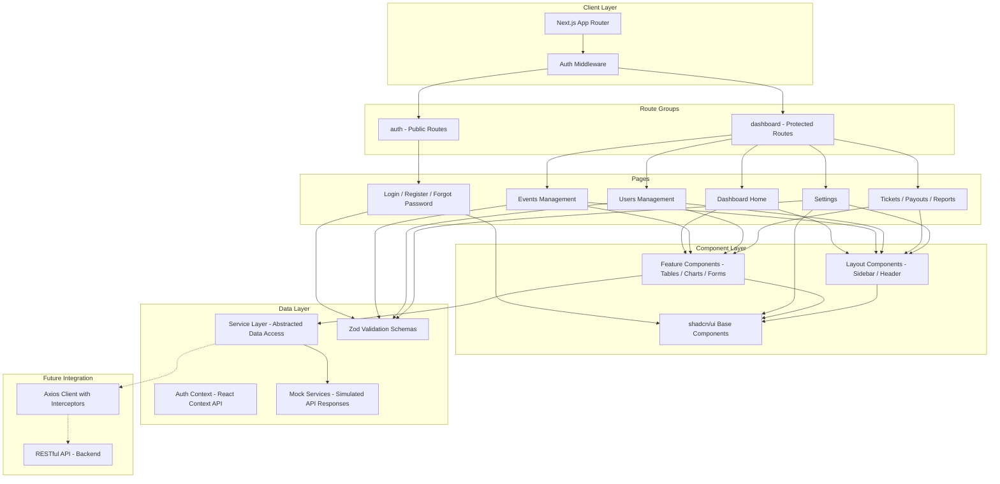
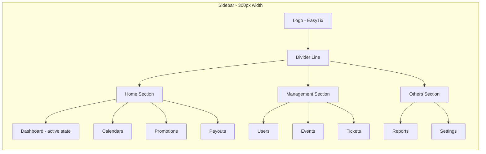

# Biletim Admin Panel - Frontend Architecture Plan

## 1. Project Overview

This is a **frontend-only** admin panel for a ticket management platform (EasyTix/Biletim). All data will be mocked until the backend API is ready. The UI must be pixel-perfect to the Figma design (MCP Channel: `63274xv1`).

---

## 2. Figma Design Inventory

### 2.1 Pages in Figma (34 frames)

| Category | Frames |
|----------|--------|
| **Auth** | Log In, Login - View, Login - Error, Register, Register - Filled, OTP Verification, Forgot Password, Enter New Password |
| **Dashboard** | Home page, Home page - Notifications, AI Features, Search |
| **Events** | Events, Events Management, My Event - Create, My Event - Update |
| **Tickets** | Ticket Sales, Ticket - Ticket Type (x2) |
| **Users** | Users Management (x3), Users Management - Categories, Users Management - Confirm Delete |
| **Finance** | Payouts, Reports - Sales Reports |
| **Settings** | General, Plan, Account, Payment & Billing, Tax & Duties, Link Account, Time & Language, Password, Push Notifications |

### 2.2 Design Tokens (Extracted from Figma)

#### Colors

```typescript
// Primary
const primary = {
  DEFAULT: '#09724a',   // Main green - buttons, active states, logo background
  dark: '#066d41',      // Darker green - stat card background
  light: '#0d9762',     // Lighter green - gradients, decorative elements
  accent: '#00fb90',    // Bright green - decorative circles
}

// Neutral / Text
const neutral = {
  900: '#0d0d12',       // Primary text, headings
  800: '#0f1613',       // Active sidebar text
  700: '#1f1f21',       // Chart labels, secondary headings
  600: '#000000',       // Table text, strong labels (with opacity variations)
  500: '#666d80',       // Muted text, subtitles
  400: '#818898',       // Placeholder text
  300: '#e5e7eb',       // Borders, dividers
  200: '#f7f7f7',       // Background, input bg, sidebar active bg
  100: '#ffffff',       // White backgrounds
}

// Status / Semantic
const status = {
  success: '#09724a',       // Published, Approved badges
  successBg: '#effefa',     // View action button bg
  warning: '#d39c3d',       // Pending badges
  danger: '#df1c41',        // Cancelled, Banned, Rejected badges
  dangerBg: '#fff0f3',      // Delete action bg, danger badge bg
  info: '#f0fbff',          // Edit action bg
}

// Badge backgrounds
const badge = {
  successBorder: '#09724a',
  successText: '#09724a',
  warningBorder: '#d39c3d',
  warningText: '#d39c3d',
  dangerBorder: '#df1c41',
  dangerText: '#df1c41',
}
```

#### Typography

```typescript
// Font Families
const fonts = {
  primary: 'Manrope',       // Used everywhere
  secondary: 'Inter Tight', // Only in "Don't have account? Register" link
}

// Type Scale
const typography = {
  // Headings
  h1: { fontSize: 32, fontWeight: 600, lineHeight: '41.6px', letterSpacing: '-0.96px' },  // Right panel CRM text
  h2: { fontSize: 24, fontWeight: 700, lineHeight: '31.2px', letterSpacing: '-0.48px' },  // Welcome Back
  h3: { fontSize: 20, fontWeight: 600, lineHeight: '27px', letterSpacing: '0' },          // Page titles (Dashboard, My Events)
  h4: { fontSize: 18, fontWeight: 600, lineHeight: '25.2px', letterSpacing: '0.36px' },   // Stat card values
  h5: { fontSize: 16, fontWeight: 600, lineHeight: '24px', letterSpacing: '0.32px' },     // Section titles (Ticket Sales Analytics, Best Visited)
  
  // Body
  body: { fontSize: 16, fontWeight: 400, lineHeight: '24px', letterSpacing: '0.32px' },   // Body text, subtitles
  bodyMedium: { fontSize: 16, fontWeight: 500, lineHeight: '24px', letterSpacing: '0' },   // Medium body
  bodySemiBold: { fontSize: 16, fontWeight: 600, lineHeight: '24px', letterSpacing: '0.32px' }, // Button labels

  // Small
  sm: { fontSize: 14, fontWeight: 400, lineHeight: '21px', letterSpacing: '0.28px' },     // Form labels, stat card labels
  smMedium: { fontSize: 14, fontWeight: 500, lineHeight: '21px', letterSpacing: '0.28px' }, // Input labels, table cells
  smSemiBold: { fontSize: 14, fontWeight: 600, lineHeight: '21px', letterSpacing: '0.28px' }, // Button small, nav active
  
  // Extra Small
  xs: { fontSize: 12, fontWeight: 400, lineHeight: '18px', letterSpacing: '0.24px' },     // Profile email, table small
  xsMedium: { fontSize: 12, fontWeight: 500, lineHeight: '18px', letterSpacing: '0.24px' }, // Badge text, dropdown
  xsSemiBold: { fontSize: 12, fontWeight: 600, lineHeight: '18px', letterSpacing: '0.24px' }, // Profile name, shortcut
  
  // Sidebar
  nav: { fontSize: 14, fontWeight: 500, lineHeight: '16.8px', letterSpacing: '-0.28px' },   // Sidebar items
  navActive: { fontSize: 14, fontWeight: 600, lineHeight: '16.8px', letterSpacing: '-0.28px' }, // Sidebar active item
  navCategory: { fontSize: 14, fontWeight: 400, lineHeight: '16.8px', letterSpacing: '-0.28px' }, // Sidebar category label
}
```

#### Spacing & Layout

```typescript
const layout = {
  // Page dimensions
  pageWidth: 1440,
  pageHeight: 1024,
  
  // Sidebar
  sidebarWidth: 300,
  sidebarPadding: 16,
  sidebarItemHeight: 44,
  sidebarItemRadius: 10,
  sidebarItemPadding: 12, // left padding to icon
  sidebarIconSize: 20,
  sidebarIconToText: 12,  // gap between icon and text
  
  // Header
  headerHeight: 72,
  headerPadding: 16,      // vertical padding (72 - 40) / 2
  
  // Content area
  contentBg: '#f7f7f7',
  contentPadding: 16,     // from sidebar edge to first card
  
  // Cards / Stat Cards
  statCardWidth: 265,
  statCardHeight: 136,
  statCardRadius: 20,
  statCardPadding: 16,
  statCardGap: 16,
  
  // Icon containers
  iconContainerSize: 40,
  iconContainerRadius: 10,
  iconSize: 20,
  
  // Tables
  tableRadius: 16,
  tableHeaderHeight: 40,
  tableRowHeight: 64,
  tableCellPadding: 12,
  
  // Buttons
  buttonHeight: 52,        // Login button
  buttonSmallHeight: 40,   // Create Event button
  buttonRadius: 52,        // Login (pill)
  buttonSmallRadius: 8,    // Create Event
  
  // Inputs
  inputHeight: 52,
  inputRadius: 10,
  inputPadding: 12,
  
  // Badges
  badgeHeight: 20,
  badgeRadius: 16,
  badgePadding: '0 6px',
  
  // Search
  searchWidth: 240,
  searchHeight: 40,
  searchRadius: 8,
  
  // Pagination
  paginationButtonSize: 32,
  paginationButtonRadius: 8,
}
```

#### Border Radius Values

```
4px   - Checkbox, keyboard shortcut
6px   - Action buttons (view, edit, delete)
8px   - Search bar, logo container, pagination buttons, small buttons
10px  - Input fields, sidebar items, icon containers, table filter buttons
16px  - Table container, badges
20px  - Stat cards, chart cards, notification bell, sidebar card radius
30px  - Login right panel
52px  - Login button (pill shape)
96px  - Login user icon container (circle)
```

---

## 3. Project Structure

```
src/
├── app/
│   ├── (auth)/
│   │   ├── login/
│   │   │   └── page.tsx
│   │   ├── register/
│   │   │   └── page.tsx
│   │   ├── forgot-password/
│   │   │   └── page.tsx
│   │   ├── otp-verification/
│   │   │   └── page.tsx
│   │   ├── new-password/
│   │   │   └── page.tsx
│   │   └── layout.tsx
│   ├── (dashboard)/
│   │   ├── dashboard/
│   │   │   └── page.tsx
│   │   ├── events/
│   │   │   ├── page.tsx              # Events Management list
│   │   │   ├── create/
│   │   │   │   └── page.tsx
│   │   │   └── [id]/
│   │   │       ├── page.tsx          # Event detail
│   │   │       └── edit/
│   │   │           └── page.tsx
│   │   ├── tickets/
│   │   │   ├── page.tsx              # Ticket Sales
│   │   │   └── types/
│   │   │       └── page.tsx
│   │   ├── users/
│   │   │   └── page.tsx
│   │   ├── payouts/
│   │   │   └── page.tsx
│   │   ├── reports/
│   │   │   └── page.tsx
│   │   ├── settings/
│   │   │   ├── page.tsx              # General settings
│   │   │   ├── plan/
│   │   │   │   └── page.tsx
│   │   │   ├── account/
│   │   │   │   └── page.tsx
│   │   │   ├── payment/
│   │   │   │   └── page.tsx
│   │   │   ├── tax/
│   │   │   │   └── page.tsx
│   │   │   ├── link-account/
│   │   │   │   └── page.tsx
│   │   │   ├── time-language/
│   │   │   │   └── page.tsx
│   │   │   ├── password/
│   │   │   │   └── page.tsx
│   │   │   └── notifications/
│   │   │       └── page.tsx
│   │   └── layout.tsx                # Dashboard shell: Sidebar + Header + Content
│   ├── layout.tsx                    # Root layout
│   ├── page.tsx                      # Redirect to /login or /dashboard
│   └── globals.css
│
├── components/
│   ├── ui/                           # shadcn/ui base components
│   │   ├── button.tsx
│   │   ├── input.tsx
│   │   ├── checkbox.tsx
│   │   ├── badge.tsx
│   │   ├── card.tsx
│   │   ├── table.tsx
│   │   ├── select.tsx
│   │   ├── dialog.tsx
│   │   ├── dropdown-menu.tsx
│   │   ├── toast.tsx
│   │   ├── skeleton.tsx
│   │   └── ...
│   ├── layout/
│   │   ├── sidebar.tsx               # Collapsible sidebar
│   │   ├── sidebar-nav-item.tsx
│   │   ├── header.tsx                # Top header bar
│   │   ├── search-bar.tsx
│   │   ├── user-menu.tsx
│   │   ├── notification-bell.tsx
│   │   └── breadcrumb.tsx
│   ├── dashboard/
│   │   ├── stat-card.tsx
│   │   ├── sales-chart.tsx
│   │   ├── best-visited-map.tsx
│   │   └── recent-payouts-table.tsx
│   ├── events/
│   │   ├── events-table.tsx
│   │   ├── event-form.tsx
│   │   ├── event-status-badge.tsx
│   │   └── ticket-type-config.tsx
│   ├── users/
│   │   ├── users-table.tsx
│   │   ├── user-role-badge.tsx
│   │   └── delete-user-dialog.tsx
│   ├── tables/
│   │   ├── data-table.tsx            # Reusable TanStack Table wrapper
│   │   ├── data-table-pagination.tsx
│   │   ├── data-table-toolbar.tsx
│   │   └── table-actions.tsx
│   └── shared/
│       ├── logo.tsx
│       ├── page-header.tsx
│       └── empty-state.tsx
│
├── lib/
│   ├── api/
│   │   ├── client.ts                 # Axios instance + interceptors
│   │   └── endpoints.ts              # API endpoint constants
│   ├── services/
│   │   ├── auth.service.ts
│   │   ├── events.service.ts
│   │   ├── users.service.ts
│   │   ├── tickets.service.ts
│   │   ├── payouts.service.ts
│   │   ├── reports.service.ts
│   │   └── settings.service.ts
│   ├── mock/
│   │   ├── auth.mock.ts
│   │   ├── events.mock.ts
│   │   ├── users.mock.ts
│   │   ├── tickets.mock.ts
│   │   ├── payouts.mock.ts
│   │   └── dashboard.mock.ts
│   ├── hooks/
│   │   ├── use-auth.ts
│   │   ├── use-sidebar.ts
│   │   └── use-debounce.ts
│   ├── context/
│   │   └── auth-context.tsx
│   ├── utils/
│   │   ├── cn.ts                     # Tailwind class merger
│   │   ├── format.ts                 # Date, currency formatters
│   │   └── constants.ts
│   └── validations/
│       ├── auth.schema.ts
│       ├── event.schema.ts
│       ├── user.schema.ts
│       └── settings.schema.ts
│
├── types/
│   ├── auth.types.ts
│   ├── event.types.ts
│   ├── user.types.ts
│   ├── ticket.types.ts
│   ├── payout.types.ts
│   ├── report.types.ts
│   ├── settings.types.ts
│   └── api.types.ts                  # Generic API response wrappers
│
└── middleware.ts                      # Route protection
```

---

## 4. Architecture Diagram



---

## 5. Component Architecture - Sidebar Navigation



### Sidebar Navigation Items from Figma:

| Section | Item | Icon Type |
|---------|------|-----------|
| **Home** | Dashboard | Widget (Bold) |
| | Calendars | Calendar Minimalistic (Linear) |
| | Promotions | Sale (Linear) |
| | Payouts | Bank (mingcute) |
| **Management** | Users | User Rounded (Linear) |
| | Events | Music Note (Linear/Bold) |
| | Tickets | f7:tickets |
| **Others** | Reports | Danger Triangle (Linear) |
| | Settings | Settings (Linear) |

---

## 6. Key Design Specifications

### 6.1 Login Page Layout
- **Viewport**: 1440 x 1024px
- **Left panel**: Form area starting at x:82, width:436px
- **Right panel**: Image/CRM info, starts at x:638, width:778px, corner-radius:30px, semi-transparent white bg (opacity 0.4)
- **Logo**: Top-left at x:32, y:32, green container (#09724a) with rounded corners (9.85px)
- **Decorative ellipses**: Green (#09724a) circles with 80% opacity for visual depth
- **Login button**: Full width (436px), height 52px, pill shape (border-radius:52px), bg:#09724a
- **Input fields**: Height 52px, border-radius:10px, semi-transparent border and bg

### 6.2 Dashboard Layout
- **Sidebar**: Width 300px, white bg, right border #e5e7eb
- **Content area**: Starts at x:300, bg:#f7f7f7
- **Header**: Height 72px, white bg, bottom border #e5e7eb
- **Content padding**: 16px from sidebar edge

### 6.3 Stat Cards (Dashboard)
- **4 cards** in a row, each 265x136px, gap:16px
- **First card** (Total Revenue): Green bg (#066d41) with white text
- **Other cards**: White bg with border #e5e7eb
- **Corner radius**: 20px
- **Badge**: Height 20px, radius 34px, shows percentage change

### 6.4 Table Design
- **Container**: Corner radius 16px, border #e5e7eb
- **Header row**: bg:#f7f7f7, height 40px, radius 10px
- **Data rows**: Height 64px, white bg
- **Row separator**: Border #e5e7eb (between rows)
- **Actions column**: 3 icon buttons (View: #effefa, Edit: #f0fbff, Delete: #fff0f3), each 28x28px, radius 6px
- **Pagination**: Bottom section with page numbers (32x32px), active page bg:#09724a

---

## 7. TypeScript Type Definitions (Preview)

```typescript
// types/auth.types.ts
interface LoginRequest {
  email: string;
  password: string;
  rememberMe?: boolean;
}

interface LoginResponse {
  user: User;
  token: string;
  refreshToken: string;
}

// types/event.types.ts
interface Event {
  id: string;
  name: string;
  dateTime: string;
  ticketsSold: number;
  revenue: number;
  status: 'published' | 'pending' | 'cancelled' | 'draft' | 'rejected';
  organizer?: string;
  description?: string;
  location?: string;
  ticketTypes?: TicketType[];
  createdAt: string;
  updatedAt: string;
}

// types/payout.types.ts
interface PayoutRequest {
  id: string;
  organizer: string;
  amount: number;
  contact: string;
  requestedOn: string;
  status: 'pending' | 'approved' | 'rejected';
  processedOn?: string;
}

// types/user.types.ts
interface User {
  id: string;
  name: string;
  email: string;
  phone: string;
  role: 'super_admin' | 'admin' | 'organizer' | 'attendee';
  status: 'active' | 'banned' | 'suspended';
  avatar?: string;
  createdAt: string;
}
```

---

## 8. Implementation Priority

### Priority 1 - Foundation (Start Here)
1. Project initialization with Next.js 15 + TypeScript
2. Tailwind CSS configuration with all Figma tokens
3. shadcn/ui setup with custom theme
4. Folder structure creation
5. Login page (pixel-perfect to Figma)

### Priority 2 - Core Shell
6. Auth context + middleware
7. Dashboard layout (Sidebar + Header)
8. Dashboard Home page with stat cards and charts

### Priority 3 - CRUD Pages
9. Events Management (table + pagination)
10. Event Create/Edit forms
11. Users Management

### Priority 4 - Additional Features
12. Payouts, Reports, Ticket Sales pages
13. Settings pages (9 sub-pages)
14. Search, Notifications, AI Features

### Priority 5 - Polish
15. Responsive design
16. Loading/error states
17. Animations and transitions
18. Final Figma alignment check

---

## 9. Dependencies

```json
{
  "dependencies": {
    "next": "^15.0.0",
    "react": "^19.0.0",
    "react-dom": "^19.0.0",
    "typescript": "^5.0.0",
    "@tanstack/react-table": "^8.0.0",
    "react-hook-form": "^7.0.0",
    "@hookform/resolvers": "^3.0.0",
    "zod": "^3.0.0",
    "recharts": "^2.0.0",
    "lucide-react": "^0.300.0",
    "axios": "^1.0.0",
    "class-variance-authority": "^0.7.0",
    "clsx": "^2.0.0",
    "tailwind-merge": "^2.0.0",
    "tailwindcss-animate": "^1.0.0",
    "@radix-ui/react-slot": "^1.0.0",
    "@radix-ui/react-dialog": "^1.0.0",
    "@radix-ui/react-dropdown-menu": "^2.0.0",
    "@radix-ui/react-checkbox": "^1.0.0",
    "@radix-ui/react-select": "^2.0.0",
    "@radix-ui/react-toast": "^1.0.0"
  }
}
```

---

## 10. Font Setup

The primary font is **Manrope** (Google Fonts). Secondary font **Inter Tight** is used sparingly.

```typescript
// app/layout.tsx
import { Manrope, Inter_Tight } from 'next/font/google'

const manrope = Manrope({
  subsets: ['latin'],
  variable: '--font-manrope',
  display: 'swap',
})

const interTight = Inter_Tight({
  subsets: ['latin'],
  variable: '--font-inter-tight',
  display: 'swap',
})
```
