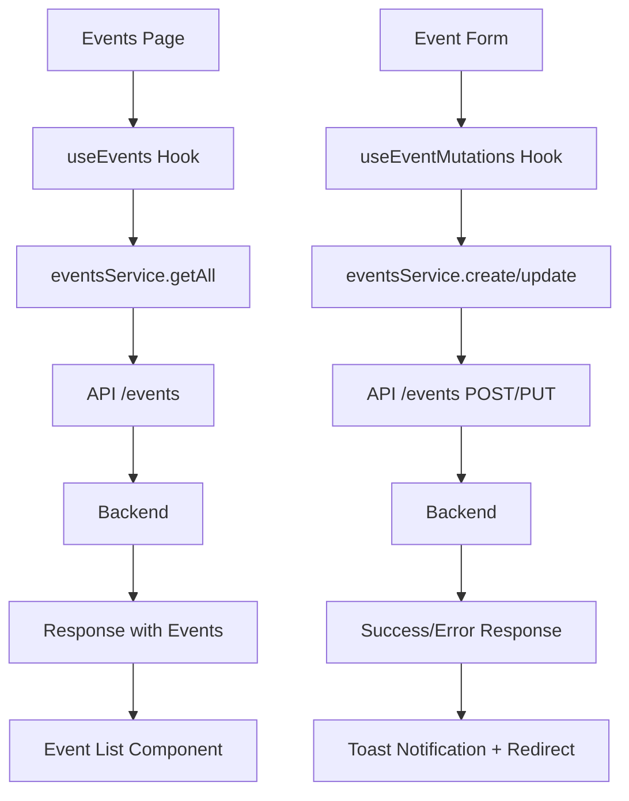

# Etkinlikler Modülü Planı

## Genel Bakış

Bu plan, Etkinlikler modülünün backend API ile tam entegrasyonunu kapsamaktadır. Mevcut kod yapısındaki patterns (venues, organizations) takip edilerek tutarlı bir mimari hedeflenmektedir.

## Mevcut Durum Analizi

### Backend API Endpoints

| Endpoint | Method | Açıklama |
|----------|--------|----------|
| `/api/v1/events` | GET | Tüm etkinlikleri listeler (organizasyon bazlı filtrelenmiş) |
| `/api/v1/events/{id}` | GET | Etkinlik detayı |
| `/api/v1/events` | POST | Yeni etkinlik oluştur |
| `/api/v1/events/{id}` | PUT | Etkinlik güncelle |
| `/api/v1/events/{id}` | DELETE | Etkinlik sil |
| `/api/v1/events/{id}/status` | PATCH | Etkinlik durumu güncelle |
| `/api/v1/event-categories` | GET | Kategorileri listele |

### Backend Event Entity Yapısı

```typescript
interface Event {
  id: number;
  organization_id: number;
  organization?: Organization;
  venue_id: number;
  venue?: Venue;
  category_id: number;
  category?: EventCategory;
  title: string;
  slug: string;
  description?: string;
  short_description?: string;
  start_date: string;
  end_date: string;
  status: "draft" | "published" | "cancelled" | "completed" | "ongoing";
  featured_image?: string;
  thumbnail?: string;
  ticket_price?: number;
  total_tickets?: number;
  available_tickets?: number;
  sold_tickets?: number;
  min_tickets_per_order?: number;
  max_tickets_per_order?: number;
  is_featured?: boolean;
  is_published?: boolean;
  created_at: string;
  updated_at: string;
}
```

### Mevcut Frontend Durumu

- **Events Page**: Mock data kullanıyor, backend entegrasyonu yok
- **Event Types**: İki farklı tip dosyası var (`event.types.ts` ve `biletleme.types.ts`)
- **Events Service**: Temel metodlar mevcut ama tam entegre değil
- **Validation Schema**: Backend API yapısına uymuyor

---

## Uygulama Planı

### 1. Tip Tanımlamalarını Güncelle

**Dosya**: `src/lib/api/types/biletleme.types.ts`

Mevcut tipler zaten backend ile uyumlu. Eklenmesi gerekenler:

```typescript
// Paginated response tipi
export interface PaginatedResponse<T> {
  data: T[];
  current_page: number;
  last_page: number;
  per_page: number;
  total: number;
  from: number;
  to: number;
  links?: {
    first: string;
    last: string;
    prev: string | null;
    next: string | null;
  };
}

// Event ile ilişkili tam tip
export interface EventWithRelations extends Event {
  organization?: Organization;
  venue?: Venue;
  category?: EventCategory;
}
```

**Dosya**: `src/types/event.types.ts`

Bu dosya artık kullanılmayacak. Tüm tipler `biletleme.types.ts` üzerinden yönetilecek.

### 2. Validation Schema Güncelleme

**Dosya**: `src/lib/validations/event.schema.ts`

Backend API yapısına uygun yeni schema:

```typescript
import { z } from "zod";

export const eventSchema = z.object({
  title: z.string().min(3, "Etkinlik adı en az 3 karakter olmalıdır"),
  description: z.string().optional().nullable(),
  short_description: z.string().max(255).optional().nullable(),
  organization_id: z.number().min(1, "Organizasyon seçilmelidir"),
  venue_id: z.number().min(1, "Mekan seçilmelidir"),
  category_id: z.number().min(1, "Kategori seçilmelidir"),
  start_date: z.string().min(1, "Başlangıç tarihi gereklidir"),
  end_date: z.string().min(1, "Bitiş tarihi gereklidir"),
  featured_image: z.string().url().optional().nullable(),
  ticket_price: z.number().min(0).optional().nullable(),
  total_tickets: z.number().min(1).optional().nullable(),
  min_tickets_per_order: z.number().min(1).optional().nullable(),
  max_tickets_per_order: z.number().min(1).optional().nullable(),
  is_featured: z.boolean().optional(),
});

export const createEventSchema = eventSchema;
export const updateEventSchema = eventSchema.partial();

export type EventFormValues = z.infer<typeof eventSchema>;
export type CreateEventFormValues = z.infer<typeof createEventSchema>;
export type UpdateEventFormValues = z.infer<typeof updateEventSchema>;
```

### 3. Events Service Güncelleme

**Dosya**: `src/lib/api/services/events.service.ts`

```typescript
class EventsService {
  // List with filters and pagination
  async getAll(filters?: EventFilters): Promise<Event[]>;
  
  // Get paginated results
  async getPaginated(filters?: EventFilters): Promise<PaginatedResponse<Event>>;
  
  // Get single event with relations
  async getById(id: number): Promise<EventWithRelations>;
  
  // Create event
  async create(data: CreateEventRequest): Promise<Event>;
  
  // Update event
  async update(id: number, data: UpdateEventRequest): Promise<Event>;
  
  // Delete event
  async delete(id: number): Promise<void>;
  
  // Update status only
  async updateStatus(id: number, status: EventStatus): Promise<Event>;
  
  // Publish event
  async publish(id: number): Promise<Event>;
  
  // Cancel event
  async cancel(id: number): Promise<Event>;
}
```

### 4. Custom Hook'lar

**Dosya**: `src/lib/hooks/use-events.ts`

```typescript
// Hook'lar
export function useEvents(filters?: EventFilters);
export function useEvent(id: number);
export function useEventCategories();
export function useEventMutations();
```

### 5. Sayfa Yapısı

```
src/app/(dashboard)/events/
├── page.tsx              # Liste sayfası (güncellenecek)
├── [id]/
│   └── page.tsx          # Detay sayfası (yeni)
├── create/
│   └── page.tsx          # Oluşturma sayfası (yeni)
└── [id]/
    └── edit/
        └── page.tsx      # Düzenleme sayfası (yeni)
```

### 6. Bileşen Yapısı

```
src/components/events/
├── event-form.tsx        # Form bileşeni (yeni)
├── event-list.tsx        # Liste bileşeni (yeni)
├── event-card.tsx        # Kart bileşeni (yeni)
├── event-filters.tsx     # Filtre bileşeni (yeni)
└── event-status-badge.tsx # Durum badge'i (yeni)
```

---

## Detaylı Bileşen Planları

### Events List Page (`page.tsx`)

**Özellikler:**
- Server-side veya client-side data fetching
- Status filtreleme (draft, published, cancelled, completed, ongoing)
- Arama (title, description)
- Organizasyon filtresi
- Mekan filtresi
- Kategori filtresi
- Tarih aralığı filtresi
- Sayfalama
- Sıralama

**Tablo Kolonları:**
1. Etkinlik Adı + Kategori
2. Tarih & Saat
3. Mekan
4. Organizasyon
5. Bilet Durumu (satılan/toplam)
6. Durum Badge
7. İşlemler (görüntüle, düzenle, sil)

### Event Detail Page (`[id]/page.tsx`)

**Özellikler:**
- Etkinlik temel bilgileri
- Organizasyon bilgisi
- Mekan bilgisi
- Kategori bilgisi
- Bilet istatistikleri
- Durum değiştirme
- Hızlı işlemler

### Event Form Component (`event-form.tsx`)

**Form Alanları:**
- Title (zorunlu)
- Description (opsiyonel)
- Short Description (opsiyonel, max 255)
- Organizasyon seçimi (dropdown, zorunlu)
- Mekan seçimi (dropdown, zorunlu)
- Kategori seçimi (dropdown, zorunlu)
- Başlangıç tarihi (datetime picker, zorunlu)
- Bitiş tarihi (datetime picker, zorunlu)
- Featured Image (URL, opsiyonel)
- Bilet fiyatı (number, opsiyonel)
- Toplam bilet sayısı (number, opsiyonel)
- Min bilet/sipariş (number, opsiyonel)
- Max bilet/sipariş (number, opsiyonel)
- Öne çıkan (checkbox, opsiyonel)

---

## Veri Akışı



---

## Status Renk Eşleştirmesi

| Status | Badge Variant | Renk |
|--------|---------------|------|
| draft | neutral | Gri |
| published | success | Yeşil |
| cancelled | danger | Kırmızı |
| completed | info | Mavi |
| ongoing | warning | Turuncu |

---

## Hata Yönetimi

1. **API Hataları**: `apiClient` interceptor'ları ile yakalanır
2. **Validation Hataları**: Zod schema + react-hook-form
3. **Network Hataları**: Toast notification ile kullanıcıya bildirilir
4. **401 Unauthorized**: Login sayfasına yönlendirme

---

## Dosya Değişiklikleri Özeti

### Güncellenecek Dosyalar
- `src/lib/api/types/biletleme.types.ts` - PaginatedResponse eklenecek
- `src/lib/api/services/events.service.ts` - Metodlar optimize edilecek
- `src/lib/validations/event.schema.ts` - Backend yapısına uygun hale getirilecek
- `src/app/(dashboard)/events/page.tsx` - API entegrasyonu yapılacak

### Oluşturulacak Dosyalar
- `src/lib/hooks/use-events.ts` - Custom hook'lar
- `src/components/events/event-form.tsx` - Form bileşeni
- `src/components/events/event-filters.tsx` - Filtre bileşeni
- `src/components/events/event-status-badge.tsx` - Status badge
- `src/app/(dashboard)/events/[id]/page.tsx` - Detay sayfası
- `src/app/(dashboard)/events/create/page.tsx` - Oluşturma sayfası
- `src/app/(dashboard)/events/[id]/edit/page.tsx` - Düzenleme sayfası

### Silinecek/Kullanılmayacak Dosyalar
- `src/types/event.types.ts` - Artık kullanılmıyor
- `src/lib/mock-data/events.ts` - Mock data kaldırılacak

---

## Uygulama Sırası

1. Tip tanımlamaları ve validation schema güncellemesi
2. Events service optimizasyonu
3. Custom hook'ların oluşturulması
4. Event form bileşeni
5. Events list sayfası güncellemesi
6. Event detail sayfası
7. Event create sayfası
8. Event edit sayfası
9. Mock data temizliği
